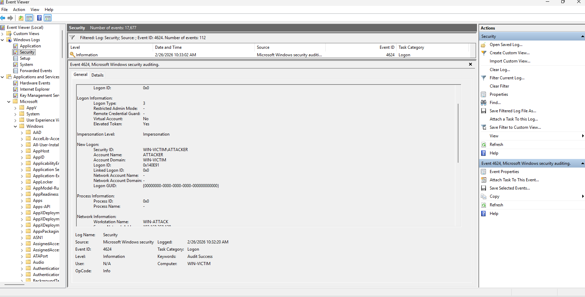
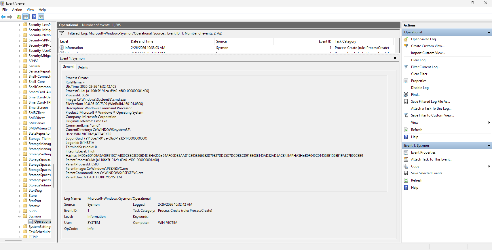
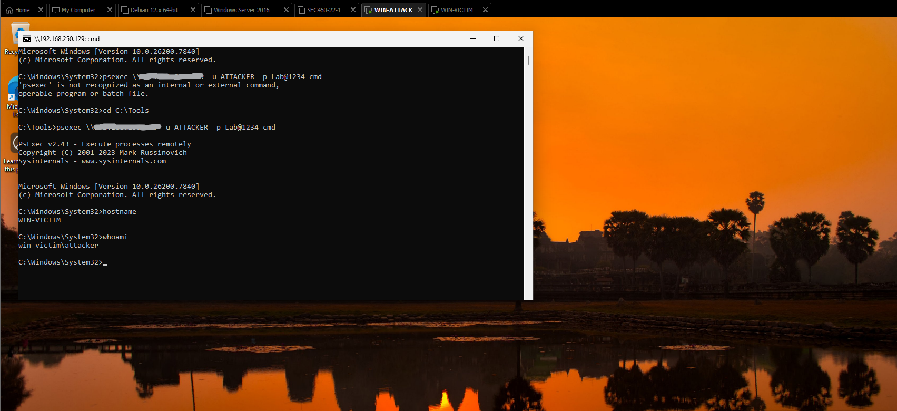

# PsExec Lateral Movement Incident Analysis

## Executive Summary

This project demonstrates the detection and investigation of PsExec-based lateral movement between two Windows systems. 

By correlating Windows Security Event Logs (4624, 7045) and Sysmon telemetry (Event ID 1), the attack chain was successfully reconstructed and mapped to MITRE ATT&CK techniques.

# Scenario
- This lab simulates a lateral movement attack using PsExec between two Windows machines (WIN-ATTACK → WIN-VICTIM).
The objective was to detect and analyze the activity using Windows Event Logs and Sysmon.

# Attack Timeline 
1. Successful Network Logon (Event ID 4624 - Logon Type 3)
2. Service Installation (Event ID 7045 - PSEXESVC)
3. Remote Command Execution (Sysmon Event ID 1)

# MITRE ATT&CK Mapping 
- T1021.002 – SMB/Windows Admin Shares
- T1569.002 – Service Execution
- T1059.003 – Windows Command Shell

# Detection Strategy
Detection can be achieved by monitoring:
- Event ID 4624 (Type 3 logons)
- Event ID 7045 (Service creation)
- Sysmon Event ID 1 (Parent process = PSEXESVC.exe)

# Key Takeaways
- Importance of monitoring service creation events
- Correlating 4624 + 7045 + Sysmon Event ID 1
- Detecting administrative lateral movement activity

## Event ID 4624 – Network Logon

## Event ID 7045 – Service Creation

## Sysmon Event ID 1 – Process Execution

## PsExec Remote Terminal

